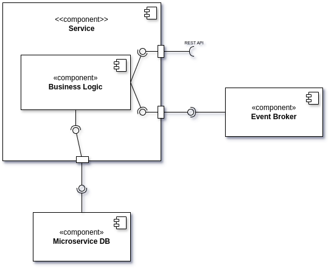
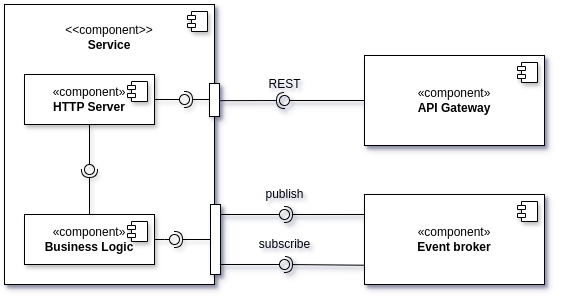
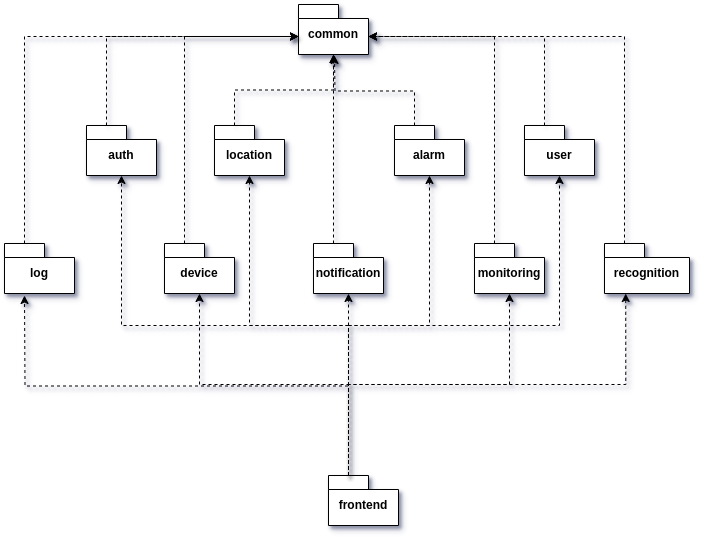

# Architecture

We choosed to use a **microservices** architecture for the system. This architecture is a way to design software applications as suites of independently deployable services. Each service runs in its own process and communicates with other services through a well-defined interface. The decomposition strategy that we used is by *bounded contexts*. Here are the services that we identified:

- **Auth**: responsible for authentication and authorization.
- **Alarm**: responsible for analyzing the data coming from sensors and cameras and consequently notifying anomalies.
- **User**: responsible for managing user data.
- **Location**: responsible for managing location data.
- **Device**: responsible for managing devices joined to the system.
- **Recognition**: responsible for recognizing people and objects video streams.
- **Monitoring**: it is the main service that enables the user to monitor the system.
- **Notification**: responsible for delivering notifications to the user.
- **Log**: responsible for logging system events.

## Software architecture documentation

In the following sections, we will describe the software architecture of the system.

### Components & Connectors

Each service has a *subcomponent* that contains the core **business logic (BL)** of the service. In other to do its work the BL may make use of other components that are mainly: a *database* (when needed) and a *event message broker*. While the datasase holds the necessary data needed by the service in order to perform its tasks, the event message broker is used to both to communicate with other services and, in some cases, it may be used by external nodes to provide data to particular microservices. Each service can publish events and subscribe to events. 
The main access to the service however is through a **REST Api**. The REST Api is masked to the external world by an **API Gateway**. The Gateway is responsible for routing the requests to the correct service. The API Gateway is also responsible for the authentication and authorization of the requests.

### Module view

### Deployment view

