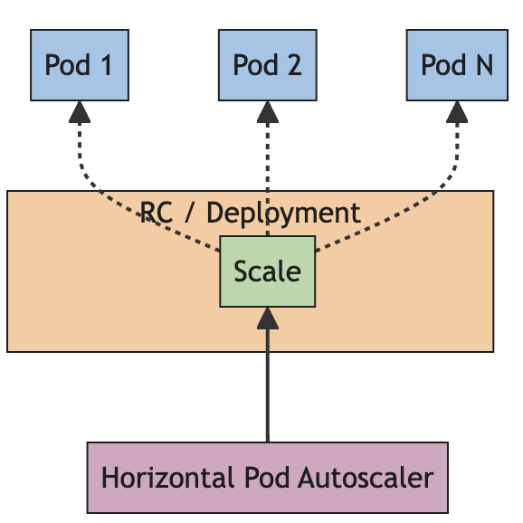

# Kubernetes

Revue can be deployed using **Kubernetes**.
The system is mapped to Kubernetes components like **Deployments**,
**Services**, **Ingress**, **Persistent Volume Claims**, and **ConfigMaps**.

In particular, for core microservices of the system, the following k8s configuration files are provided:

- **Deployment**: it is responsible for creation and the lifecycle of pods.
- **Service**:
    - ClusterIP: when there's no need to expose the service outside the cluster.
    - LoadBalancer: to expose the service outside the cluster.
- **Ingress**: An API object that manages external access to the services in a cluster, typically HTTP. An ingress lets
  you map traffic to different backends based on rules you define via the Kubernetes API.
- **Horizontal Pod Autoscaler**: to automatically adjust the number of pods based on the current service's workload.

For those services that need to store data, also the following configuration files are provided:

- **Persistent Volume Claim**: to store data that needs to persist even after the pod is deleted.
- **ConfigMap**: to store configuration data and database initialization scripts.

We chose to use [Traefik](https://traefik.io/) as the Ingress Controller and reverse proxy.
Traefik is a modern HTTP reverse proxy and load balancer that can be used to expose services outside the cluster.
Each request to a microservice will pass through Traefik, which will route the request to the correct service.


### Prerequisites

- A Kubernetes cluster running
- `kubectl` installed
- `Metallb` or a cloud provider Load Balancer
- `Helm Charts` installed

With Revue, it is also provided a guide to creating a K3s cluster on Raspberry PIs 5
that can be found [here](https://github.com/revue-org/revue-kubernetes).

### How to deploy the system

1. Log in to your cluster's master node.
2. Clone the [revue-kubernetes](https://github.com/revue-org/revue-kubernetes/) repository.
3. Move to the cloned repository
4. Run:

```bash
 ./deploy.sh
```

#### Notes

- This guide assumes that cluster is running on a on-premise environment. In particular `MetalLB` is used to expose
  services outside the cluster.

### Horizontal pod autoscaling

A [HorizontalPodAutoscaler](https://kubernetes.io/docs/tasks/run-application/horizontal-pod-autoscale/) (HPA)
in Kubernetes scales the workload horizontally by increasing or decreasing the number of Pods in response to load
changes.



The scaling is based on specific configurations file in which resources limits are defined.
This helped us to meet QA requirements and to optimize the resources used by the system, limiting the costs.

Example of a configuration file targeting CPU usage:

```yaml
  metrics:
    - type: Resource
      resource:
        name: cpu                            # Scale based on CPU usage
        target:
          type: Utilization
          averageUtilization: 60             # Target 60% CPU utilization
```

#### Benchmark

The system has been tested with a load of 1000 requests per second,
and the autoscaling feature has been able to manage the workload efficiently.
Every service can scale up to 5 replicas.
You can find the bash scripts to stress the system with different workloads in
the [revue-kubernetes](https://github.com/revue-org/revue-kubernetes) repository.
