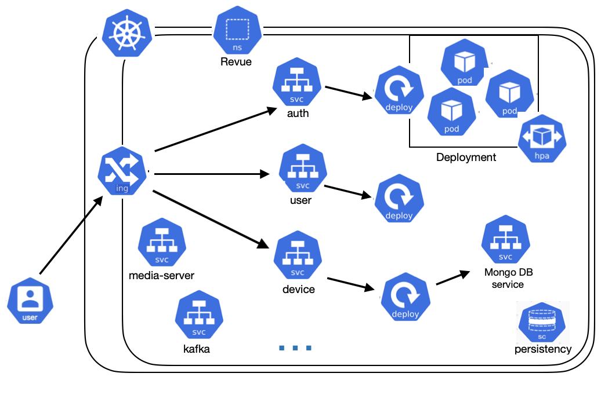

For production environments, Revue can be deployed using **Kubernetes**.
The system is mapped to Kubernetes components like **Deployments**,
**Services**, **Ingress**, **Persistent Volume Claims**, and **ConfigMaps**.

In particular, for core services of the system, the following configurations are provided:

- **Deployment**: responsible for creating pods and managing their lifecycle.
- **Service**: type ClusterIP, with no need to be exposed outside the cluster due to the presence of the Ingress Controller (API Gateway).
- **Ingress**: to expose the service outside the cluster through the Ingress Controller.
- **Persistent Volume Claim**: to store data that needs to persist even after the pod is deleted.
- **ConfigMap**: to store configuration data and database initialization scripts.
- **Horizontal Pod Autoscaler**: to automatically adjust the number of Pods in a workload based on current demand.

Every service is accessible through the Ingress Controller,
which is responsible for routing the requests to the correct service.
In this case, the Ingress Controller is [Traefik](https://traefik.io/),
a modern HTTP reverse proxy and load balancer that can be used to expose services outside the cluster.



### Prerequisites

- A Kubernetes cluster running
- `kubectl` installed
- `Helm Charts` installed

With Revue, it is also provided a guide to creating a K3s cluster on Raspberry PIs 5
that can be found [here](https://github.com/revue-org/revue-k3s-deployment).

### Step-by-step guide

Before deployment, you'll need the Revue configuration files and an active Load Balancer,
provided either by your cloud provider or installed manually on bare-metal environments.

1. Install the Ingress Controller, in this case, Traefik:
      ```bash
      helm repo add traefik https://traefik.github.io/charts
      helm repo update
      helm install traefik traefik/traefik --values gateway/traefik-values.yml
      ```
2. Install Grafana.
      ```bash
        helm repo add grafana https://grafana.github.io/helm-charts
        helm repo update
        helm install grafana grafana/grafana -f prometheus/grafana-values.yml --namespace YOUR_NAMESPACE
      ````
3. Install Prometheus.
      ```bash
      helm repo add prometheus-community https://prometheus-community.github.io/helm-charts
      helm repo update
      helm install prometheus prometheus-community/prometheus -f prometheus/prometheus-values.yml
      ```
4. Install or check for a Load Balancer, such as ([MetalLB](https://metallb.universe.tf/installation/)).
   A guide for Raspberry Pi deployment can be found here.

### Deploy the System

1. Download the YAML configurations
   file [here](https://github.com/revue-org/revue-k3s-deployment/tree/main/specifications/k3s).
2. Enter the folder where the files are downloaded.
3. Run:

```bash
 kubectl apply -f .
```

This deploys core services, each with its **Deployment**, **Service** (**ClusterIP** for internal exposure), **Ingress
**, **Persistent Volume Claims**, and **ConfigMaps**.

#### Notes

- The system uses [Traefik](https://traefik.io/traefik/) as the Ingress Controller and reverse proxy.
- LoadBalancer services require either an external load balancer from a cloud provider or manual installation on
  bare-metal.

### Horizontal pod autoscaling

A [HorizontalPodAutoscaler](https://kubernetes.io/docs/tasks/run-application/horizontal-pod-autoscale/) (HPA)
in Kubernetes automatically adjusts the number of Pods in a workload based on current demand.
It scales the workload horizontally by increasing or decreasing the number of Pods in response to load changes.


The scaling is based on specific configurations file where limits of resources are defined.
This helped us to meet QA requirements and to optimize the resources used by the system, limiting the costs.

Example of a configuration file targeting CPU usage:
```yaml
  metrics:
    - type: Resource
      resource:
        name: cpu                            # Scale based on CPU usage
        target:
          type: Utilization
          averageUtilization: 60             # Target 60% CPU utilization
```

#### Benchmark

The system has been tested with a load of 1000 requests per second, 
and the autoscaling feature has been able to manage the workload efficiently. 
Every service can scale up to 5 replicas.
In the specification [repository](https://github.com/revue-org/revue-k3s-deployment) are available bash scripts to test the system with different loads.