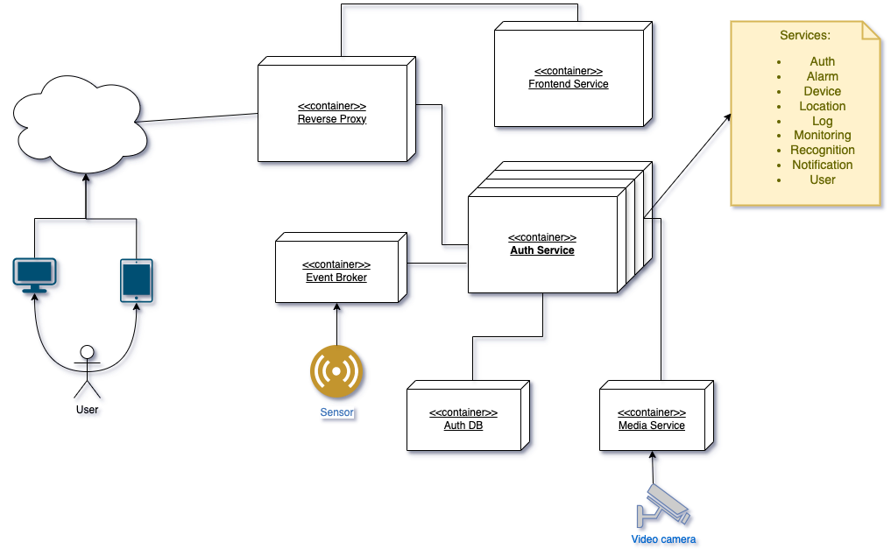

# Architecture

We chose to use a **microservices** architecture for the system.
This architecture consists on designing software applications as suites of independently deployable services. 
Each service runs in its own process and communicates with other services through a well-defined interface. 
The decomposition strategy that we used is by *bounded contexts*. 
Here are the services that we identified:

- **Auth**: responsible for authentication and authorization.
- **Alarm**: responsible for analyzing the data coming from sensors and cameras and consequently notifying anomalies.
- **User**: responsible for managing user data.
- **Location**: responsible for managing location data.
- **Device**: responsible for managing devices joined to the system.
- **Recognition**: responsible for recognizing people and objects in video streams.
- **Monitoring**: it is the main service that enables the user to monitor the system.
- **Notification**: responsible for delivering notifications to the user.
- **Log**: responsible for logging system events.

## Software architecture documentation

In the following sections, we will describe the software architecture of the system.

### Components & Connectors

Each service has a *subcomponent* that contains the core **business logic (BL)** of the service. 
To do its
work, the BL may make use of other components that are mainly: a *database* (when needed) and an *event message broker*.
While the database holds the necessary data needed by the service to perform its tasks, the event message
broker is used both to communicate with other services and, in some cases, to
provide data to particular microservices. 
Each service can publish and subscribe to events topics.
The main access to the service however is through a **REST API**. 
The REST API is faceted to the external world by a **Reverse proxy**. 
The reverse proxy is responsible for routing the requests to the correct service and the monitoring dashboards.

### Module view

Each microservice is in a separate module. 
They all depend on a `common` module. 
Finally, there is an additional module (`frontend`), that is provided to the user.

### Deployment view

Each microservice is containerized. 
Additional containers are used for the database and the event message broker. 
Also, the reverse proxy is containerized.
Container orchestration will be a responsibility of *docker compose* or *kubernetes*.
